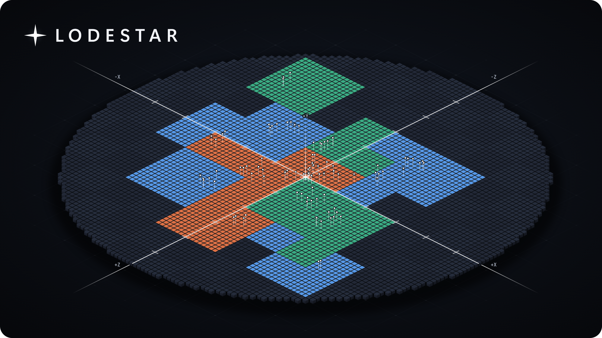
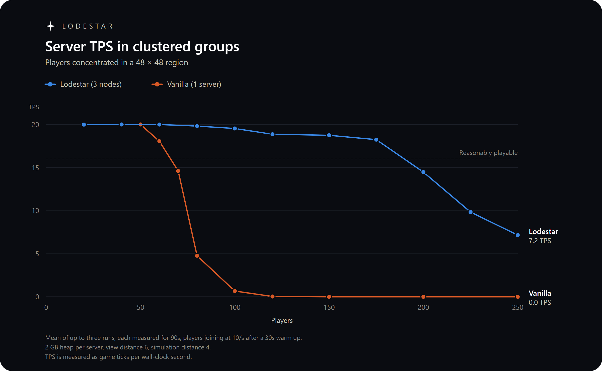

Minecraft horizontal scaling software built for large events and SMP servers. Consists of 3 modules:

- **lodeproxy**: proxy software that coordinates player connections and handoffs
- **lodestar**: the coordinator, sync, and consistency engine
- **lodecore**: the Fabric mod (Minecraft 26.3) used for all nodes of the cluster

## Building

lodestar and lodeproxy need Rust:

```sh
cargo build --release
```

The mod needs a JDK 25:

```sh
cd mod
./gradlew build        # -> mod/build/libs
```

## Testing

Lodestar has E2E testing that uses scripted players to simulate a real cluster. The test suite requires JDK 25 and a network connection on the first run (or an already installed Fabric server). Details about tests can be found in [tests/README.md](tests/README.md).

```sh
cargo test -p lodestar-e2e
```

## Running a cluster

1. Start lodestar. The first run writes `lodestar.toml` with a generated `token`.

   ```sh
   cargo run --release -p lodestar
   ```

2. Pick a forwarding secret.

3. On each Fabric server, install Fabric API and the Lodecore mod, then start it
   once to get `config/lodecore.properties`. Set `token`, `forwarding-secret`,
   and the address of lodestar. If the proxy is on another machine, also set
   `advertised-address` to where the proxy can reach this server. 
   
   *Nodes should not be reachable from the internet, though nodes with Lodecore will reject unsigned connections.*

   Start Lodestar first. Generation configuration on all workers should be the same for consistency.

4. Start lodeproxy. The first run writes `lodeproxy.toml`; set `token` and
   `forwarding_secret` and start it again.

   ```sh
   cargo run --release -p lodeproxy
   ```

5. Players connect to lodeproxy's `bind` address.

lodestar moves connected players between nodes on its own unless
`auto_handoff = false` is set in `lodestar.toml`. An operator can move one with
`/lodecore move <player> <node>` on the node the player is on. 

Worker nodes must all use the same `network-compression-threshold` so that the proxy can pass packets from one node and then another to the same client.

## Benchmarks

### Clustered Player Benchmark (6GB Vanilla vs 3x2GB Lodestar)

